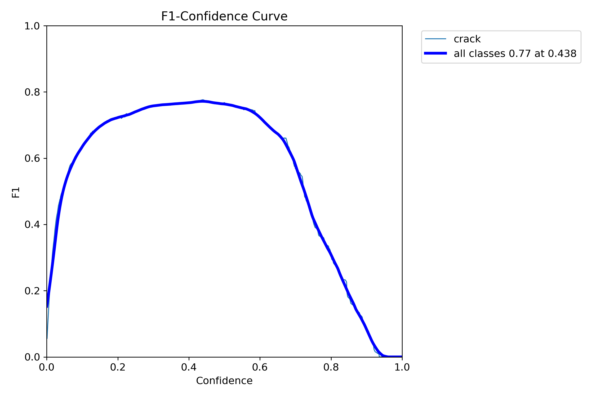

# Crack Segmentation using YOLOv8seg

## Project Overview
This project focuses on the challenging task of **crack segmentation on surfaces**. Cracks are a critical indicator of structural integrity issues, and their precise detection and segmentation are essential for automated inspection systems.

To address this, I used the **YOLOv8seg** model from the Ultralytics framework. YOLOv8seg is a state-of-the-art model for instance segmentation, capable of not only detecting cracks but also producing pixel-accurate segmentation masks.  

The model was trained on a **custom dataset** carefully annotated to outline cracks across different surfaces.

---

## Training and Results
The model was trained for **30 epochs**, yielding strong results in both bounding box detection and segmentation mask generation.

### Overall Training Results

- **Loss Reduction**: Training and validation losses consistently decreased, showing stable learning without major overfitting.  
- **High mAP Scores**:  
  - `mAP50(M)` – very high at IoU=0.5, meaning the model is excellent at identifying cracks.  
  - `mAP50-95(M)` – strong across stricter IoU thresholds, showing precise localization.  

These results confirm that the model performs well and generalizes effectively.

---

## Detailed Performance Analysis

### Training Metrics (`runs/segment/train`)
#### Bounding Box
- F1-Score  
  
- Precision  
  
- Recall  
  
- Precision-Recall  
  

#### Segmentation Mask
- F1-Score  
  
- Precision  
  
- Recall  
  
- Precision-Recall  
  

#### Confusion Matrix
- Raw  
  
- Normalized  
  

#### Label Visualization
  

---

### Validation Metrics (`runs/segment/val`)
Validation plots confirm that the model maintains strong performance outside of training:

- F1-Score (Box)  
  
- Precision-Recall (Mask)  
  

---

## Key Metrics Explained
- **Loss** – model error (lower is better).  
- **Precision** – ratio of correct positive predictions.  
- **Recall** – ratio of actual positives correctly predicted.  
- **mAP** – Mean Average Precision, standard metric for detection/segmentation.  
  - `mAP50` – lenient IoU=0.5 threshold.  
  - `mAP50-95` – stricter IoU thresholds, more robust evaluation.  
- **(B)** – Bounding Box metrics.  
- **(M)** – Mask (segmentation) metrics.  

---

## How to Get Started
To replicate these results or use the trained model:  

1. Clone this repository.  
2. Install dependencies (YOLOv8, PyTorch, etc.).  
3. Prepare your dataset in YOLO format.  
4. Run the training script with your configuration.  

_(Setup instructions and inference examples will be added here.)_  
